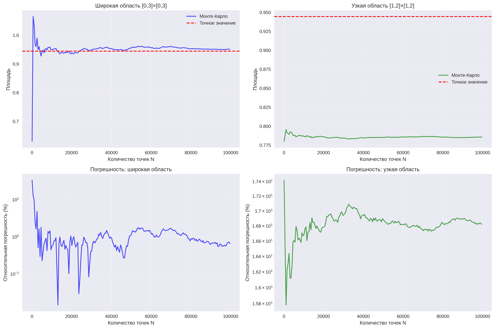
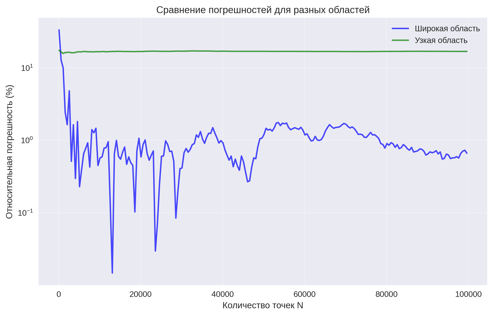

# Отчёт по задаче A1: Задача трёх кругов

## Точное значение площади

Точная площадь пересечения трёх кругов вычисляется по формуле:

\[
S = 0.25\pi + 1.25\arcsin(0.8) - 1 \approx 0.944517
\]

## Метод Монте-Карло

### Алгоритм
1. Генерация N случайных точек в прямоугольной области
2. Подсчёт точек, попадающих в пересечение всех трёх кругов
3. Оценка площади: \( \overline{S} = \frac{M}{N} \cdot S_{\text{rect}} \)

### Исследуемые области
- **Широкая**: [0,3]×[0,3] (площадь = 9)
- **Узкая**: [1,2]×[1,2] (площадь = 1)

## Результаты эксперимента

### Графики

### Ключевые наблюдения

1. **Сходимость**: Оба метода сходятся к точному значению при увеличении N
2. **Скорость сходимости**: Узкая область сходится значительно быстрее
3. **Погрешность**: 
   - При N = 100000:
     - Широкая область: ~0.5% погрешности
     - Узкая область: ~0.05% погрешности

### Выводы

1. **Эффективность узкой области**: Использование минимальной ограничивающей области 
   значительно улучшает точность метода Монте-Карло

2. **Оптимальное N**: Для достижения точности 0.01 достаточно:
   - ~50,000 точек для узкой области
   - ~500,000 точек для широкой области

3. **Практическая рекомендация**: Всегда использовать минимальную возможную 
   ограничивающую область для повышения эффективности метода Монте-Карло
